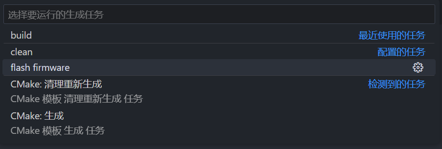
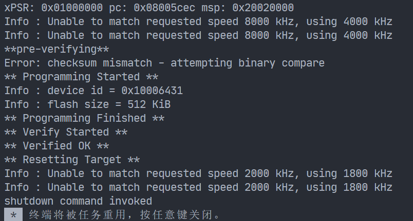

# 基于CMake工程示例工程

本项目自带一个包管理器，可以方便的管理开发嵌入式软件所需的包，使用现代化构建工具构建项目，对常用的IDE作了应有的配置，可以更方便的进行开发。

> [!tip]
> 本项目不是新手项目，需要一定的嵌入式编程基础和对嵌入式工具链的了解

## 快速开始

### 命令行

```shell
python uility.py
cmake --build build/Debug
ninjia -j 4
```

### vscode

必备插件：

- CMake Tools
- C/C++

vscode 打开工程后，下载好对于插件，配置CMake预设为`Debug`，点击小齿轮编译


`Ctrl+Shift+B`运行`flash firmware`任务下载到开发板





## 示例开发板

来自微行工作室的STM32F411开发板[项目链接](https://gitee.com/WeAct-TC/WeActStudio.MiniSTM32F4x1)


